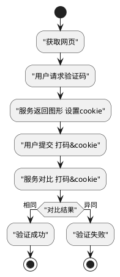

- 获取北京时间
- 前端性能优化-通用的缓存SDK
- NPM内网源搭建
- 搭建websocket服务(/node/socket)
- 搭建聊天室(/socket/)
- Node测试方案
- node插件开发(/node/plugin)
- 打造一个Node命令行工具 https://www.imooc.com/article/3156
- html模块化开发
- 移动端web的调试
- 为项目添加文档功能 [Vuepress最佳实践](/framework/vuepress.html#最佳完整实践) [Docsify](/framework/docsify)
- 免费社工库机器人  @FreeSGKbot
- Node中使用ES6模块化规范 [Node模块化ES6规范](/node/#es6模块化应用)
- 地区限制 [地区限制方案](/solution#地区限制方案)
- 流程图 跨职域流程图 数据结构表 顺序图 状态转换图 类图 [UML(Unified Modeling Language)](/tools/uml)
- 业务模块进行归并、划分时的E—R图（实体关系法）以及连带的数据结构设计
- OOA（面向对象分析） OOD（面向对象设计）
- [设计模式(Design pattern)](/designPattern)

## 解决方案
- [用户帐户体系](/solution.html#用户帐户体系sdk)
- [微前端架构](/solution#微前端架构)
- [浏览器静默与激活](/solution#浏览器静默与激活)


## 项目

## 工具
::: details 表单验证
- /demo.html
```html
<form id="formid" onsubmit="return false">
    <div id="loginNoAutocomplete"><input type="text"><input type="password"></div>
    <label>
        <input id="emai" name="email" type="text" autocomplete="true" valid="present,email">
    </label>
    <input id="submitid" value="Login" type="submit" >
</form>
```
- /form-check.js
```js
const rules = {
    mobile: v => {},
    email: v => {},
    present: v => {
        if (!v.trim()){return {type: 'present', message: '必填'}}
    }
}
export default (form) => {
    if (!(form && form.elements)) return
    const elements = form.elements
    let checkResult = []

    Array.from(elements).filter(item => item.getAttribute('valid')).map(item => {
        const valids = item.getAttribute('valid').split(',')
        const value = item.value
        let errorArr = []
        valids.forEach(valid => {
            if (rules[valid]) {
                let result = rules[valid](value)
                result && errorArr.push(result)
            }
        })
        if (errorArr.length) {
            checkResult.push({
                dom: item,
                errorArr,
                name: item.name,
                message: errorArr[0].message,
                type: errorArr[0].type
            })
        }
    })
    return checkResult
}
```
- /event.js
```js
import FormCheck from './form-check'
document.getElementById('submitid').onclick = () => {
    const checkResult = formCheck(document.getElementById('formid'))
    console.log('checkResult', checkResult)
}
```
:::

::: details 验证滑块
```html
<style> .register-verify-wrapper{height: 36px;} </style>
<div id="register-verify-wrapper" class="register-verify-wrapper"></div>
```
```js
const $ = (id) => document.getElementById(id)
const render = Symbol('render');
const bindEvent = Symbol('bindEvent');
const style =
`<style>
    .vs-wrapper { position: relative; width: 100%; height: 100%; }
    .vs-moved-bg { background: green; width: 0; position: absolute; z-index: 999; height: 100%; }
    .vs-unmoved-bg { background: gray; width: 100%; position:absolute; z-index: 998; height: 100%; }
    .vs-text { position: absolute; width: 100%; top: 0; z-index: 1000; backgound: rgba(0,0,0,0); text-align: center; }
    .vs-move-btn { height: 100%; width: 30px; background: #333333; position: absolute; top: 0; left: 0; z-index: 1001; }
</style>`
class Slider {
    constructor(opts) {
        this.opts = opts;
        if (!opts.container) {
            throw '请填写container配置';
        }
        else {
            this[render](opts);
            this[bindEvent](opts);
        }
    }

    [render](opts) {
        const unsuccessTip = opts.unsuccessTip || '请按住滑块，拖动到最右边';
        /*
         * vs = verify-slider
         */
        const tpl =  style + `
            <div id="vs-wrapper" class="vs-wrapper">
                <div id="vs-moved-bg" class="vs-moved-bg"></div>
                <span id="vs-move-btn" class="vs-move-btn"></span>
                <div id="vs-unmoved-bg" class="vs-unmoved-bg"></div>
                <span id="vs-text" class="vs-text" ondrag="return false;">${ unsuccessTip }</span>
            </div>
        `

        opts.container.innerHTML = tpl;
    }

    [bindEvent](opts) {
        const $btn = $('vs-move-btn');
        const $moved = $('vs-moved-bg');
        const $wrapper = $('vs-wrapper');
        const $text = $('vs-text');
        const reset = () => {
            this.startX = 0;
            this.start = false;
            this.end = false;
            $btn.style.left = '0px';
            $moved.style.width = '0px';
        }

        $btn.onmousedown = (e) => {
            this.startX = e.pageX;
            this.start = true;
        }

        window.onmousemove = (e) => {
            if (this.start && !this.end) {
                let offset = e.pageX - this.startX;
                let r1 = $moved.offsetLeft + parseInt(window.getComputedStyle($moved).width);
                let r2 = parseInt(window.getComputedStyle($wrapper).width) - parseInt(window.getComputedStyle($btn).width);
                $btn.style.left = offset + 'px';
                $moved.style.width = offset + 'px';
                if (r1 >= r2) {
                    this.end = true;
                    this.start = false;
                    $btn.style.left = r2 + 'px';
                    $moved.style.width = r2 + 'px';
                    opts.success && opts.success($wrapper, $text);
                }
            }
        }

        window.onmouseup = (e) => {
            if (!this.end) {
                reset();
            }
        }
    }

    reset() {
        this[render](this.opts);
        this[bindEvent](this.opts);
    }
}
```
```js
const slider = new Slider({
    container: document.getElementById('register-verify-wrapper'),
    success: async ($wrapper, $text) => { console.log('服务请求') }
}) 
```
:::

::: details NPM内网源搭建
```js
// 源 : http://127.0.0.1:7001/  
// WEB: http://127.0.0.1:7002/  

1. CNPMJS
    下载：git clone git://github.com/cnpm/cnpmjs.org.git 或 https://github.com/cnpm/cnpmjs.org/ 下载zip
    安装：cd cnpmjs.org && npm install 或 npm install --registry=http://registry.npm.taobao.org
    配置：cnpmjs.org/config/index.js 参考/* #CNPMCONFIG</strong> */

2. MySQL
    创建数据库:cnpmjs_test
    创建表:将cnpmjs.org/doc/db.sql中的内容复制出来在mysql中执行一遍即可
    $ cd /Users/xxxxxxxxxx/Project/cnpmjs.org
    $ node dispatch.js // 启动成功后，即可看到内网源的web页面了，后台自动开始同步官方模块

3. 内网源的使用
    1 安装cnpm客户端: npm i cnpm -g
    2 设置cnpm源为内网源: cnpm config set registry="http://127.0.0.1:7001"
    3 cnpm install 模块名称 // 支持所有npm命令

4. 模块发布
    1 创建用户:cnpm adduser
    2 登录:cnpm login
    3 cd 模块目录 // 注意模块名称必须带前缀，如@xxx/name，与config中的scopes配置对应
    4 cnpm publish

/* #CNPMCONFIG</strong> */
var config = {
  bindingHost: '127.0.0.1',                     // #1设置指定外网IP,默认是127.0.0.1  
                                                // #2注意，添加用户时，请添加该处配置的用户，不然不能发布模块的
  admins: {     
    fengmk2: 'fengmk2@gmail.com',
    admin: 'xxxxxxxxxx@163.com',                // #3
    dead_horse: 'dead_horse@qq.com',
  },  
  database: {      
    dialect: 'mysql',                           // #4数据库类型,目前支持: 'mysql', 'sqlite', 'postgres', 'mariadb'
  },
  enablePrivate: true,                          // #5私库开关
  scopes: ['@cnpm', '@cnpmtest', '@cnpm-test'], // #6指定私有包的前缀，避免与官方模块冲突  
  syncModel: 'exist',                           // #7
}
```
:::

::: details 开发一个NPM插件
```js
账户 u:xxxxxxxxxx  p:xxxxxxxxxxew.. e:xxxxxxxxxx@163.com  组织：seahan、angg

规范
bin   可执行二进制文件
lib   javascript代码
doc   文档
test  单元测试用例
package.json  包描述
    {
        "name": "@angg/express"
        "repository": { "type": "git", "url": "https://github.com/wmgcuan/express.git" },
        "homepage": "https://github.com/wmgcuan/express",
        "bugs": { "url": "https://github.com/wmgcuan/express/issues" }
    }

开发

发布 https://segmentfault.com/a/1190000009315989
1 $ npm adduser // 命令向导分别要求填入username/password/email,可通过 npm whoami 查看当前用户
2 $ npm publish --access public // npm publish 默认发布私有，所以会导致失败，如果是二次发布，则需先迭代version

多人发布
npm owner add <user> [<@scope>/]<pkg> # 将用户添加到包的所有者列表,如 npm owner add xxxxxxxxxx @angg/express>
npm owner rm <user> [<@scope>/]<pkg> # 从包的所有这列表中删除用户
npm owner ls [<@scope>/]<pkg> # 列出包的所有者
```
:::


### 分页


### Enter提交表单
```
<input type="text" onchange="console.log(this.value);" />
<input type="text" onkeydown="handleKeydown(event)" />
function handleKeydown(e){ console.log(e.keyCode) }
```


#################### 运行时
文件结构

配置列表
CONF_BW = {
  THEME:     '主题站点',
  SKIN:      '主题皮肤',
  TITLE:     '站点标题',
  COPYRIGHT: '备案信息',
}
RES_PUBLIC: 'static/'
RES_PRIVATE: CONF_BW.THEME + '/'


场景：
新增一个主题站点
新增一个主题皮肤
主题皮肤变更指引：资源变迁 

#### 构建时
CONF_THEME = {
  THEME: {
    SKIN:      '主题皮肤',
    // 私有资源注册Private Resource Registration
    PRR:{
      addr: THEME // 可自定义
      res: []
    }
  }
}
打包指定站点
打包配置列表
生成场景引导 新成员
开发规范说明 新成员
公共私有目录查询

初始：
生成 THEME:配置 映射表  依据THEME快速查询

解决方案：


# 人机验证
暴力破解密码  频繁操作导致服务器压力崩溃的恶意攻击
数字、字母、中文的组合 缺点：用户需要在鼠标-键盘、中英文之间切换，不具备任何趣味性
```


### 前端工程搭建
```
npm install -g babel-cli
babel --version
demo> npm init -y 
demo> npm install --save-dev babel-preset-es2015 babel-cli

index.html    src         dist    .babelrc
              index.js

/index.html   
```html
<!DOCTYPE html>
<html>
<head>
    <meta charset="UTF-8">
    <meta name="viewport" content="width=device-width, initial-scale=1.0">
    <title>ES6项目搭建</title>
    <script src="dist/index.js"></script>
</head>
<body>
    Hello ECMA Script2016
</body>
</html>
```
/src/index.js
```js
let a = 1
console.log(a)

const b = '测试ES6'
console.log(b)
```
/.babelrc     
```json
{"presets":["es2015"], "plugins":[]}
```
/package.json
```json
{"scripts": {"build": "babel src/index.js -o dist/index.js"}}
```
demo> babel src/index.js -o dist/index.js  
或  
demo> npm run build
浏览 /index.html
```


### 前端工程搭建-Babel7+
```
https://www.babeljs.cn/docs/usage

|es6-babel7> npm init -y
|es6-babel7> npm install --save-dev [b ch|@babel/core @babel/cli]

[src[a.js], lib, package.json]
[b-blue|/src/a.js] [DETAIL/es6-project-07]
|es6-babel7> ./node_modules/.bin/babel src --out-dir lib [DETAIL/es6-project-05] 
[b-blue|/lib/a.js] [DETAIL/es6-project-07]           

[b3 cf| 指定代码转换功能 ] 箭头函数
|es6-babel7> npm install --save-dev [b ch|@babel/plugin-transform-arrow-functions]
|es6-babel7> ./node_modules/.bin/babel src --out-dir lib [b ch|--plugins=@babel/plugin-transform-arrow-functions]
[b-green|/lib/a.js] [DETAIL/es6-project-06] 

[b3 cf| 指定代码转换功能 ] 更多 避免添加很多插件 使用官方预设定(preset)
|es6-babel7> npm install --save-dev [b ch|@babel/preset-env]
|es6-babel7> ./node_modules/.bin/babel src --out-dir lib [b ch|--presets=@babel/env]
[b-green|/lib/a.js] [DETAIL/es6-project-08]

[b3 cf| 指定代码转换功能 ] 预设配置 
/babel.config.json [DETAIL/es6-project-09]
|es6-babel7> ./node_modules/.bin/babel src --out-dir lib 
[b-green|/lib/a.js] 

[b3 cf| 指定代码转换功能 ] 预设配置 Polyfill[DETAIL/es6-project-10] 
|es6-babel7> npm install --save [b ch|@babel/polyfill]
/babel.config.json [DETAIL/es6-project-11]
|es6-babel7> ./node_modules/.bin/babel src --out-dir lib 
[b-green|/lib/a.js] 


总结：
[@babel/core, @babel/cli, @babel/preset-env, @babel/polyfill]
npm install --save-dev @babel/core @babel/cli @babel/preset-env
npm install --save @babel/polyfill


▉es6-project-11▉
"useBuiltIns" 参数设置为 "usage" 时，Babel 将检查你的所有代码，以便查找目标环境中缺失的功能，然后只把必须的 polyfill 包含进来。
否则，必须在所有代码之前通过 require 加载一次完整的 polyfill。

{
  "presets": [
    [
      "@babel/env",
      {
        "targets": {
          "edge": "17",
          "firefox": "60",
          "chrome": "67",
          "safari": "11.1",
        },
        [b ci|"useBuiltIns": "usage"],
      }
    ]
  ]
}
▉
▉es6-project-10▉
@babel/polyfill 模块包含 core-js 和一个自定义的 regenerator runtime 来模拟完整的 ES2015+ 环境。

这意味着你可以使用诸如 Promise 和 WeakMap 之类的新的内置组件、 Array.from 或 Object.assign 之类的静态方法、 Array.prototype.includes 之类的实例方法以及生成器函数（generator functions）（前提是你使用了 regenerator 插件）。为了添加这些功能，polyfill 将添加到全局范围（global scope）和类似 String 这样的原生原型（native prototypes）中。

对于软件库/工具的作者来说，这可能太多了。如果你不需要类似 Array.prototype.includes 的实例方法，可以使用 transform runtime 插件而不是对全局范围（global scope）造成污染的 @babel/polyfill。

更进一步，如果你确切地知道你所需要的 polyfills 功能，你可以直接从 core-js 获取它们。
如：
require("core-js/modules/es.promise.finally");
Promise.resolve().finally();

▉
▉es6-project-09▉
{
  "presets": [
    [
    "@babel/env",
      {
        // 只为目标浏览器中没有的功能加载转换插件
        "targets": {
          "edge": "17",
          "firefox": "60",
          "chrome": "67",
          "safari": "11.1"
          }
        }
      ]
    ]
}
▉
▉es6-project-08▉
"use strict";

var a = 11;
console.log(a);

var fn = function fn() {
  return 1;
};
▉
▉es6-project-07▉
const a = 11;
console.log(a);

const fn = () => 1;
▉
▉es6-project-06▉
const a = 11;
console.log(a);

const fn = function () {
  return 1;
};
▉
▉es6-project-05▉
将解析 src 目录下的所有 JavaScript 文件输出到 lib 目录下。由于还[b ci|没有指定任何代码转换功能]，所以输出的代码将[b ci|与输入的代码相同]。

其它动行参数：
  -o, --out-file [out]                        将所有输入文件编译成一个文件.
  -d, --out-dir [out]                         将模块的输入目录编译成输出目录.
  --relative                                  编译成相对于输入目录或文件的输出目录.
  -D, --copy-files                            在非编译文件上编译目录副本时.
  --include-dotfiles                          编译和复制非编译文件时包含点文件.
  --no-copy-ignored                           在复制非编译文件时排除忽略的文件.
  --verbose                                   记录一切。这个选项与——quiet相冲突.
  --quiet                                     不记录任何东西。此选项与——verbose冲突.
  --delete-dir-on-start                       在编译前删除out目录.
  --out-file-extension [string]               对输出文件使用特定的扩展名.
  -V, --version                               输出版本号.
  -h, --help                                  输出使用信息.
▉


```




