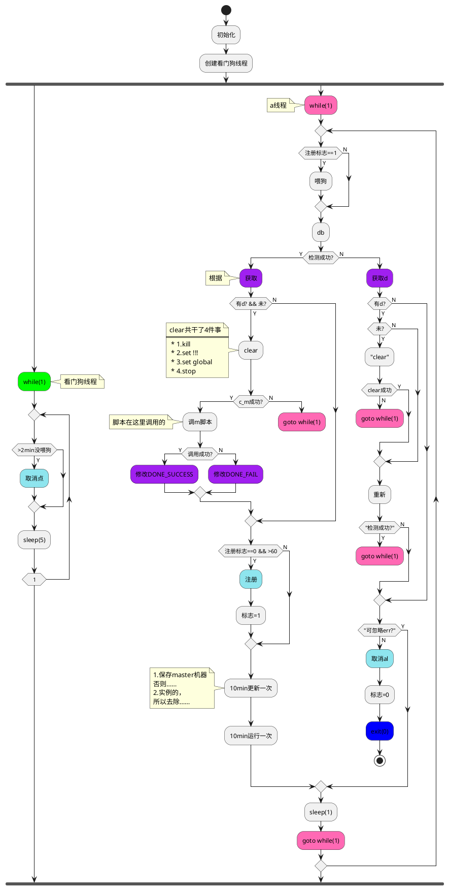

## 浏览器静默与激活
```js
var hiddenProperty = 'hidden' in document ? 'hidden' : 'webkitHidden' in document ? 'webkitHidden' : 'mozHidden' in document ? 'mozHidden' : null; // 不同浏览器 hidden 名称
var visibilityChangeEvent = hiddenProperty.replace(/hidden/i, 'visibilitychange'); // 不同浏览器的事件名
var onVisibilityChange = function(){ 
    if (!document[hiddenProperty]) { 
        console.log('页面非激活') 
    }else{ 
        console.log('页面激活') 
    } 
}
document.addEventListener(visibilityChangeEvent, onVisibilityChange);
```

## 中文获取拼音首字母及排序
http://blog.haoji.me/pinyinjs.html  key: JS版汉字与拼音互转终极方案，附简单的JS拼音输入法
['猫','狗',"鸡"].sort((a, b)=>a.localeCompare(b)) ['猫','狗',"鸡"] > ["狗", "鸡", "猫"]

## 缓存
- 本地存储
    [H5 localStorage](/html5#缓存) 永久存储，手动删除
    [H5 sessionStorage](/html5#缓存) 浏览器重新打开后消失
- sessionStorage
    [application cache](#)
- indexedDB和webSQL
    [indexedDB](#) 浏览器提供的本地数据库
    [webSQL](#) 谷歌支持ie和火狐不支持

## Node实现缓存
- [node-cache](/node/plugin#node-cache)
- 写&读JSON文件 如果是循环结构的对象将无法写成文件


行为树的原理及实现


## 用户帐户体系SDK
es6+


SDK特点
- 纯JS 无依赖
SDK要求
- 通用性 兼容性 可靠性 封装性
- 有更多使用ES6+的场景
SDK开发
- 业务逻辑为主 忽略样式和HTML结构

架构
- 环境搭建        
        ES5-SHIM支持IE8
        工程化工具WEBPACK(模块化管理、代码优化、压缩合并)(ES6+语法的编译工具BABEL(ES6+转ES6,兼容更多的浏览器))        
        合适的脚手架工具（HTML-BUNDLER）
- 架构设计
- 开发流程
参才截图

时间线

babel
demo3/
index.js
```
const a = 1
const f = (arr) => Array.from(arr)
```
demo3> babel index.js

参才截图

html-bundler

ReferenceError: primordials is not defined
node版本太高


## 需求分析
1. 产品需要什么样的内容和效果
2. 技术上需要做哪些工作才能达到产品要求
3. 技术上有哪些指标

#### 产品要求
- 包含登录／注册／找回密码／信息设置与修改
- 支持PC和移动端，各个子网站需要有自己的样式
- 功能逻辑必须统一和同步

#### 技术应对
- 通过JS SDK的方式，由一个团队统一开发维护，保证功能的统一以及修改的同步
- 支持PC和移动端，因此包体积要小，要分包，不能有依赖
- JS SDK要包含全部的业务逻辑，但不包含具体样式，由下游业务方进行自定义

#### 前端技术指标
- 浏览器兼容到IE8
- 支持PC和移动端,大小不能超过30k
- 支持多种引用方式：直接引用，commonJS(require([module])), AMD(require([module], callback)), ES6(import)


## 架构设计
原则：自顶向下，自外而内，从用户最先接触的地方开始

1. 对外的API接口设计
    - 原则
        简单易用，封装性，灵活性
    - 考虑下三个问题
        暴露什么样的接口？（类or普能函数or对象）<br>
        有哪些配置项？<br>
        默认值是什么？<br>
    - 编写公共模块的三个原则
        (1) 对外暴露函数：单一功能，且无内部状态<br>
        (2) 对外暴露对象：无关联的功能集合<br>
        (3) 对外暴露class(构造函数):互相关联的功能集合或存有内部状态的功能<br>
2. 模块的划分与关联<br>
<br>
    如何编写一个业务模块
    - init: 初始化，用于接受参数和设置初始值
    - render: 渲染，
    - event: 事件绑定

3. 模块的具体实现与一般性套路


App

特性：纯js 无依赖
要求：通用性 兼容性 可靠性 封装性
架构：
    搭建es6+工程环境：webpack babel  
    模块：common 登录 注册 账号设置 密码找回

[s14 b ci|场景]
MPA
SPA
Portal
### 身份验证
chrome 身份验证器 插件
身份验证器用以在浏览器中生成二步认证代码


## 站点账号体系SDK
```
npm i html-bundler -g
hb create es6-passport -w

es6-passport> npm install
es6-passport> hb dev
```

## 环境准备
```
npm install es5-shim babel-polyfill --save-dev        //安装必要的polyfill
    es6-passport/webpack.dll.js
        const vendors = ['es5-shim', 'babel-polyfill']
    es6-passport> npm run dll              // vendors重新生成

npm install gulp-file-include --save-dev  //加入gulp-file-include
    用于HTML内引入外部模板，如header footer
    es6-passport/html-bundler.config.js
        var fileInclude = require('gulp-file-include')
        // 生产
        var destMod = {
            custom: {
                html:[{func:fileInclude, opts:{prefix:'@@',basepath:'@file'}}]
            }
        }
        // 开发
        var devMod = {
            custom: {
                html:[{func:fileInclude, opts:{prefix:'@@',basepath:'@file'}}]
            }
        }
es6-passport/html/templates
es6-passport/html/templates/header.html
    <div class="header"></div>
es6-passport/html/templates/footer.html
    <div class="footer"></div>
es6-passport/html/templates/index.html
    @@include('./template/header.html', {})
    @@include('./template/footer.html', {})
es6-passport> hb dev
```

## 开发
- src/js/common/config.js
```js
export default {
    loginFormId: 'form',
    loginSubmitId: 'submit',
    loginInputAccountId: 'input',
    loginInputPasswordId: 'password'
}
```
- src/js/common/formCheck.js
```js
export default (form) => {
    return () => {
        alert(form.id)
        return []
    }
}
```
- src/js/login/init.js
```js
import render from './render'
import event from './event'
import config from '../common/config'
import formCheck from '../common/formCheck'

window.login = (options) => {
    const container = options.container
    render(container)
    event()
}
```
- src/js/login/render.js
```js
import {loginFormId, loginInputAccountId, loginInputPasswordId, loginSubmitId} from '../common/config'
export default (container) => {
    const tpl = `<form id="${loginFormId}">
        <input name="account" type="text" id="${loginInputAccountId}">
        <input name="password" type="password" id="${loginInputPasswordId}">
        <input value="登录" type="submit" id="${loginSubmitId}">
    </form>`
    container.innerHTML = tpl
}
```
- src/js/login/event.js
```js
import {loginFormId, loginSubmitId, loginInputAccountId} from '../common/config'
import formCheck from '../common/formCheck'
export default () => {
    const btn = document.getElementById(loginSubmitId)
    const input = document.getElementById(loginInputAccountId)
    const check = formCheck(document.getElementById(loginFormId))

    btn.onclick = () => {
        check()
    }
    input.oninput = () => {
        check()
    }
}
```


为什么要模块化


npm i fetch-mock --save-dev
common/mock.js
```
import FetchMock from 'fetch-mock'

// FetchMock.mock('/login', {code:200, message:'success'})

FetchMock.mock('/login', (url, opts) => {
    const params = opts.params
    if (params.account === '123456789') {
        if (params.password === '123456') {
            return {code:200, message:'success'}
        } else {
            return {code:401, message: 'password error!'}
        }
    } else {
        return {code:400, message: 'account error!'}
    }
})
```


[表单验证](/scene)
无状态 输出函数


## register注册
```

登录 login/init.js

忘记密码 forget/init.js

注册 设用户名 register/mobile/init.js
注册 账号信息 register/info/init.js
注册 支付方式 register/payment/init.js
注册 注册成功 无

个人资料 register/info/init.js
收货地址 delivery-address/init.js
安全设置 security/init.js

填写手机号 ───────────────────────────────────────────────────────────────────────────────┐
活人验证 失败 ┌───────────────────────────────────────────────────────────────┐           │
        成功：激活验证按钮(下一步)  点击提交                              VerifyToken  ┌─ phone    phone
                                          表单验证      ┌─────────────────────┼──────────┤         │
                                                  获取验证码 失败  ┌───────────└──────────┼────────┘ 
                                                             成功：填写验证码[] 注册提交   │
                                                                                       注册请求 失败
                                                                                                成功：

```

#### 流程图
[PlantUML](/programmingLanguage/plantuml)



:"步骤1处理";
:"步骤2处理";
if ("条件1判断") then (true)
    :条件1成立时执行的动作;
    if ("分支条件2判断") then (no)
        :"条件2不成立时执行的动作";
    else
        if ("条件3判断") then (yes)
            :"条件3成立时的动作";
        else (no)
            :"条件3不成立时的动作";
        endif
    endif
    :"顺序步骤3处理";
endif
if ("条件4判断") then (yes)
:"条件4成立的动作";
else
    if ("条件5判断") then (yes)
        :"条件5成立时的动作";
    else (no)
        :"条件5不成立时的动作";
    endif
endif